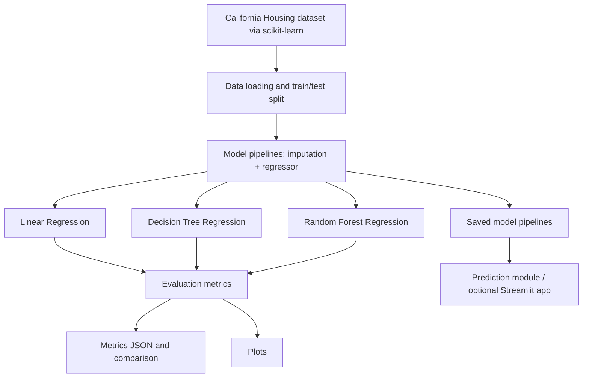

# System Architecture

## Components
- `src/data_preprocessing.py`: loads data and creates reproducible train/test splits.
- `src/train_model.py`: defines, trains, evaluates, and saves model pipelines.
- `src/evaluate_model.py`: generates plots and displays a comparison.
- `src/predict.py`: loads a saved pipeline and predicts from feature values.
- `app.py`: optional Streamlit user interface.
